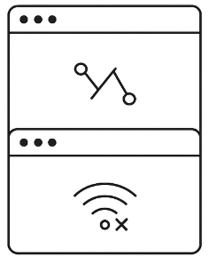
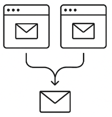

# **Intro - 기술적인 배경 지식**

## WebSocket

### 1. TCP

웹소켓(WebSocket)은 **TCP(Transmission Control Protocol)** 위에서 동작합니다. TCP는 연결 지향적 프로토콜로서, 세 가지 주요 특징을 가집니다.

1. **순서 보장 (Ordered Delivery)**
    
    전송된 데이터는 수신 측에서 보낸 순서대로 도착합니다.
    
2. **신뢰성 보장 (Reliable Delivery)**
    
    패킷 손실 시 자동으로 재전송되며, 데이터 누락을 방지합니다.
    
3. **흐름 제어 (Flow Control)**
    
    송수신 측의 처리 속도 차이를 조정하여 혼잡을 방지합니다.
    

즉, TCP는 안정적인 데이터 통신을 보장하기 때문에 WebSocket은 별도의 전송 보장 메커니즘 없이도 안정적인 메시지 전달이 가능합니다. [RFC 793, IETF]

### 2. WebSocket & StompJS

**WebSocket**은 기존 HTTP 요청-응답 방식과 달리 **양방향 통신**을 지원합니다. [RFC 6455, IETF]

- 클라이언트와 서버 간에 **지속적인 연결**을 유지합니다.
- 이벤트 기반으로 데이터를 주고받을 수 있습니다. 이는 서버가 능동적으로 Client에게 메시지를 전달할 수 있게 합니다.

StompJS는 다음과 같이 사용 가능합니다. 연결 수립 이후, 반드시 하나 이상의 구독 채널을 등록해야 합니다. 그래야 해당 채널로부터 메시지를 수신할 수 있습니다.

```tsx
import { Client } from '@stomp/stompjs';

const client = new Client({
  brokerURL: 'wss://example.com/ws',
  connectHeaders: {
    Authorization: `Bearer ${yourAccessToken}`,
  },
  onConnect: () => {
    // 구독 설정
    client.subscribe('/topic/room/1', (message) => {
      console.log('Received:', message.body);
    });
  },
  onStompError: (frame) => {
    console.error('Broker error:', frame.headers['message']);
  },
});

// 연결 시작
client.activate();
```

## Zustand

### 1. Props 전달 및 문제점

리액트(React)에서는 상태(state)를 상위 컴포넌트에서 하위 컴포넌트로 전달하기 위해 `props`를 사용합니다. 그러나 계층 구조가 복잡해질수록 **props drilling** 문제가 발생할 수 있으며, 이는 다음과 같은 문제를 야기합니다.

- 여러 계층의 Component에서 필요 없는 props를 중간에 계속 전달해야 하는 불편함이 발생합니다.
- 컴포넌트 구조가 깊어질수록 유지 보수가 어려워집니다.

```tsx
// props drilling 예시
function App() {
  const [user, setUser] = useState("홍길동");
  return <Layout user={user} />;
}

function Layout({ user }: { user: string }) {
  return <Header user={user} />;
}

function Header({ user }: { user: string }) {
  return <p>안녕하세요, {user}님</p>;
}

```

### 2. Zustand

**Zustand**는 리액트 애플리케이션에서 전역 상태를 관리하기 위한 **가볍고 직관적인 상태 관리 라이브러리**입니다. 주요 특징과 기본 사용법은 다음과 같습니다.

1. **간단한 API -** Redux처럼 보일러플레이트가 많지 않습니다.
2. **React Context API 기반 아님 -** 불필요한 re-rendering을 최소화합니다.
3. **TypeScript 친화적 -** 타입 추론과 정의가 용이합니다.

```tsx
import create from 'zustand';

// store 정의
interface UserState {
  user: string;
  setUser: (name: string) => void;
}

const useUserStore = create<UserState>((set) => ({
  user: "홍길동",
  setUser: (name) => set({ user: name }),
}));

// 컴포넌트에서 사용
function Profile() {
  const { user, setUser } = useUserStore();
  return (
    <div>
      <p>안녕하세요, {user}님</p>
      <button onClick={() => setUser("이몽룡")}>변경</button>
    </div>
  );
}

```

Zustand 외에도 사용할 수 있는 상태 관리 라이브러리는 다음과 같습니다.

1. **Redux -** 가장 널리 사용되며 강력한 미들웨어/툴링을 제공하지만, 초기 설정과 보일러플레이트 코드가 많습니다.
2. **Recoil -** 페이스북에서 개발한 라이브러리로, React와의 밀접한 통합 및 selector 기반의 유연성이 장점입니다.
3. **Jotai -** 최소 단위(atom) 기반 상태 관리, API가 단순하며 러닝 커브가 낮습니다.

Zustand는 이들 라이브러리보다 가볍고 직관적이라는 장점 때문에, 실시간 이벤트 처리(WebSocket 연동 등)를 처리하는 해당 프로젝트에서 사용된 이유입니다. 물론 팀 구성 직후의 상황을 고려해, 배우기 쉬운 라이브러리를 채택한 이유도 있습니다.

## 부록: 왜 Websocket 개발이 어려울까

Websocket을 활용해 개발하는 과정에서 많은 어려움이 있습니다. 이는 HTTP와 다른 특성인 양방향 통신에서 출발합니다. 각각 Front-end 관점과 Back-end 관점에서 서술하면 다음과 같습니다.

### 프론트엔드 관점

1. **연결 상태 관리**
    
    네트워크 환경이 불안정하면 WebSocket 연결이 자주 끊어집니다. 재연결 시, 이전 구독(subscription)을 해제하지 않으면 메시지가 중복 수신됩니다. 브라우저 탭 전환이나 모바일 환경에서는 백그라운드 상태에서 연결 유지가 까다롭습니다.
    
2. **중복 수신 문제**
    
    StompJS에서 같은 채널을 중복 구독하면 메시지가 여러 번 수신될 수 있습니다. 물론 TCP 단계에서 재전송이 발생할 경우, 중복된 메시지를 제거하게 됩니다. 하지만 그 상위 단계인 응용 계층(StompJS)에서는 서버가 같은 데이터를 여러 보내면 클라이언트에서는 중복된 메시지를 받게 됩니다.
    
    
    
    
3. **상태 관리 연동**
    
    들어오는 메시지를 React 상태와 동기화해야 하는데, 잘못하면 불필요한 리렌더링이 발생합니다. 따라서 실시간 데이터(예: 채팅, 게임 이벤트)를 컴포넌트 트리에 효율적으로 반영하는 것이 과제입니다.
    
4. **보안/인증 처리**
    
    연결 후에는 HTTP 헤더 인증을 쓸 수 없으므로 JWT 토큰을 주기적으로 갱신해 연결을 유지해야 합니다. 토큰이 만료되면 자동으로 연결을 끊고 재연결하는 로직을 클라이언트에서 직접 구현해야 합니다.
    
5. **디버깅 난이도**
    
    메시지가 중복 수신되거나 누락되는 경우, 문제가 클라이언트인지 서버인지 파악하기 어렵습니다. 네트워크 패널에서도 WebSocket 메시지 트래픽을 추적하는 과정이 복잡합니다. 예를 들어 sender에서 메시지를 제대로 보냈는지, Stompjs 구독 채널이 제대로 등록되었는지 등 여러가지 문제로 메시지에 문제가 생길 수 있습니다.
    

### 백엔드 관점

1. **세션 관리**
    
    WebSocket은 HTTP와 달리 지속 연결(persistent connection)을 사용하므로, 다수의 동시 연결을 관리해야 합니다. 서버는 각 클라이언트 세션을 추적하고, 연결 종료나 네트워크 단절 시 자원을 해제해야 합니다.
    
2. **스케일링 문제**
    
    단일 서버에서는 수천~수만 개의 연결을 처리할 수 있지만, 대규모 서비스에서는 서버 간 세션 공유가 필요합니다. 이를 위해 Redis Pub/Sub, Kafka 같은 메시지 브로커를 활용한 분산 처리 구조가 요구됩니다.【Nginx WebSocket Proxy 사례】.
    
3. **브로드캐스트 최적화**
    
    동일 이벤트를 여러 구독자에게 전달할 때, 비효율적인 브로드캐스트는 서버 부하를 급격히 증가시킵니다. 따라서 메시지 라우팅, 구독 그룹 관리, 중복 전송 방지 로직을 구현해야 합니다.
    
4. **보안 및 인증**
    
    클라이언트의 초기 핸드셰이크에서 토큰 검증을 수행해야 하고, 이후에도 토큰 갱신 요청을 처리할 수 있어야 합니다. 인증되지 않은 클라이언트가 장시간 연결을 유지하지 못하도록 서버 측에서 강제 종료하는 메커니즘이 필요합니다.
    
5. **에러 처리**
    
    네트워크 불안정으로 인해 동일 메시지를 재전송할 수 있는데, 이 과정에서 중복 전송이 발생할 수 있습니다. “exactly-once delivery”를 보장하지 않기 때문에, 백엔드 로직 차원에서 메시지 ID 기반 중복 제거가 필요합니다.
    

정리하면, **프론트엔드**는 주로 연결 상태 관리, 상태 관리 라이브러리(Zustand 등)와의 연동, 보안/재연결 로직을 잘 구성해야 한다는 과제가 있습니다. 반면 **백엔드**는 세션 유지, 분산 처리, 브로드캐스트 최적화, 인증 및 메시지 중복 제어를 해결하는 것이 중요합니다.