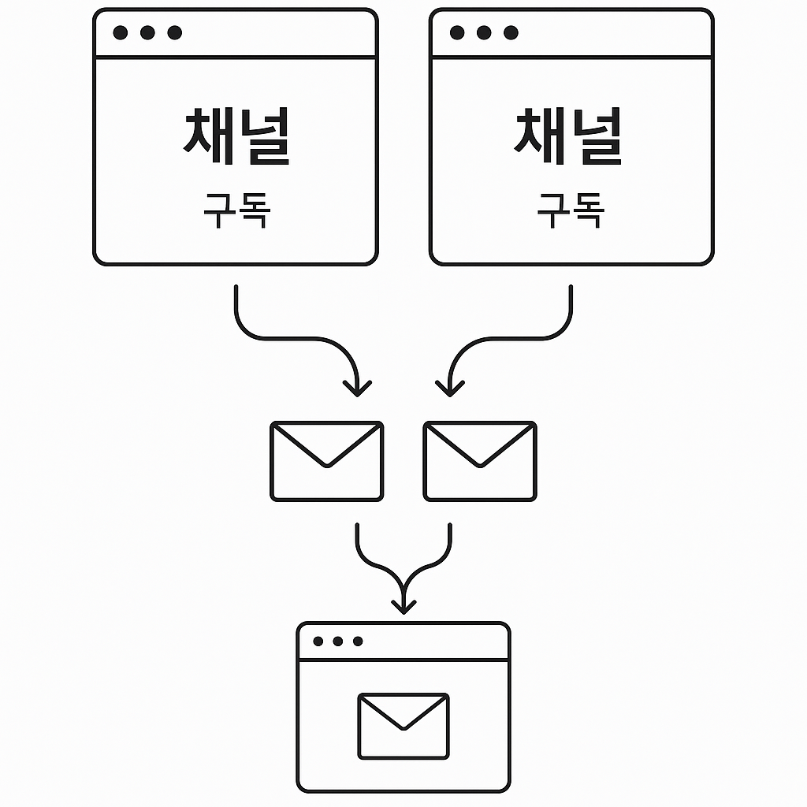
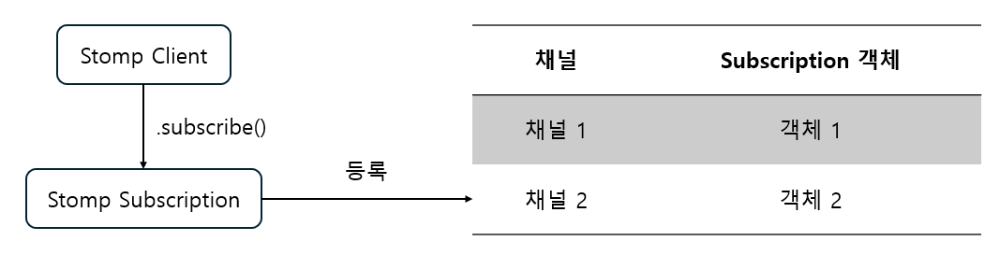

# 1. 메시지 관리

### 메시지가 중복되는 오류

StompJS를 사용해 Websocket을 개발하는 단계는 처음이었습니다. 때문에 연결을 수립하는 것부터 수행하였습니다. 처음에는 연결만 하면 바로 메시지 수신을 하는 줄 알았더니, 그것만으로는 메시지 수신을 못하는 것을 알게 되었습니다. 나중에 공식 문서를 보게 되었는데, 연결에 추가로 구독 채널을 설정해줘야, 채널로부터 메시지를 수신하게 된다는 것을 깨닫게 되었습니다.

그렇게 문제를 해결한 뒤, 첫 번째 메시지를 보냈는데, 메시지가 중복으로 표기되는 문제가 발생합니다. 처음에도 이 문제는 일시적인 문제라 생각해 Websocket을 재연결하는 방법을 생각했습니다. 하지만, 게임 중 이 문제가 발생했을 때 사용자 입장에서 새로 고침을 누른다는 게 엄청난 불편함을 야기합니다. (그리고 웹 게임이 아닌 환경에서는 새로 고침을 한다는 것도 어렵습니다.) 그렇기에 본질적인 문제를 조금 더 찾고자 하였고, 다음의 원인들을 생각하게 됩니다.

1. 중복 구독 채널



비록 TCP가 네트워크 계층에서 중복 메시지를 제거한다고 하지만, StompJS가 응용 계층에서 동작하기 때문에 중복 구독 채널은 개발 과정에서 직접 관리해줘야 합니다. 게임방 연결 로직을 구성하는 과정에서는 방 입퇴장에서 구독 채널 등록/해제가 빈번하게 일어납니다.

문제는 웹 실행 과정에서는 개발자가 실제로 어떤 채널이 등록되고 해제되는 지 알지 못합니다. 개발 과정에서 최적의 방법으로 한번만 구독 등록/해제를 요청한다 해도, 실제 환경에서는 네트워크 오류, 새로 고침, 탭 전환 등의 변수가 발생할 수 있기 때문입니다.

2. 발신 메시지 중복 호출


중복 구독에 비해 낮은 확률이지만, 책임 분리를 하지 않거나 로직 처리에 실수가 발생할 경우 발신 메시지를 중복 호출하는 상황이 나올 수도 있습니다. 다만 이 경우는 적절하게 책임 분리를 한 뒤 Websocket에서 상태 관리로 이어지는 로직을 적절하게 설계하면 해결되는 경우가 많습니다. (해당 문제에 대한 해결책은 2. 코드 관리, 3. 상태 관리에서 더 자세하게 다루겠습니다.)

### 중복 구독 방지 방법

그렇게 StompJS 문서를 보면서 원인을 찾던 중, 아이디어를 얻게 됩니다. Stomp Client가 구독을 하게 되면, 아래 코드처럼 `StompSubscription` 이라는 객체를 반환합니다. 이를 통해 Client 단에서 자신이 현재 구독 중인 채널을 간접적으로 알 수 있게 됩니다. 비유하면 객체에 이름을 달아주는 방식이지요. Store에 Subscription 리스트를 저장해, 현재 구독 중인 채널 정보를 가지는 것입니다.

```tsx
const sub = client.subscribe(LOBBY_TOPIC, (message) => { ... });
```



`Channel: Subscription` 형태로 저장된 데이터는, 이후 중복 구독에 있어 검사 용도로 활용됩니다. 즉, Subscription 리스트에 이미 구독한 채널이 있다면 생략하는 식으로, 중복 구독을 방지하는 것입니다. 만약 방 퇴장 등으로 구독 해제가 필요한 경우, 해당 Store에서도 삭제됩니다. 이러면 sender 함수를 한 번만 호출한다는 가정 아래에서는, 확실하게 한 번만 메시지를 받을 수 있겠죠. 이 방법을 사용하면서, 멱등성에 대해서도 이해하게 됩니다.

### **멱등성 (Idempotence)**

수학 용어에서 파생된 단어로, 멱등하다는 것은 첫 번째 수행을 한 뒤 여러 차례 적용해도 결과를 변경시키지 않는 작업 또는 기능의 속성을 뜻합니다. 즉, 멱등한 작업의 결과는 한 번 수행하든 여러 번 수행하든 같아야 한다는 점을 의미합니다.

네트워크/브로커는 “적어도 한 번(at-least-once)” 전달될 수 있어 중복·재전송·순서 뒤바뀜이 발생할 수 있습니다. 그러므로 같은 사건이 여러 번 와도 결과가 한 번 처리한 것과 동일해야 합니다. 다행히 일반적인 웹 개발 환경인 HTTP에서는 `PUT`/`DELETE` 등이 이 성질을 갖도록 정의되어 있습니다. 굳이 따지자면 데이터를 서버로 전송하는 `POST` / `PATCH` 를 주의해서 사용하는 정도로 끝납니다.

반면, StompJS에서는 중복 구독을 허용하는 구조로 되어 있기 때문에 이를 개발하는 과정에서 과제로 남게 됩니다. 앞으로 이와 같은 개발에서 가지는 철학은 의외로 간단했습니다. 이 당시 ChatGPT에게 질문하면서 다음과 같은 답변을 얻었습니다.

> **“실제 사건이 발생했는지 100% 확신할 수 없고, 전달이 중복될 수도 있다”** 를 항상 전제로 둔다.


즉, 같은 이벤트가 여러 번 와도 상태가 변하지 않게 연산을 설계하는 것이 개발의 원래 목적입니다. 특히 지금처럼 WebSocket 환경에서는 **같은 이벤트가 여러 번 들어올 수 있다는 전제**로 방어 코드를 짜는 게 안정성 면에서 좋다고 생각합니다. (ChatGPT는 이를 실무에서 **idempotent state update 패턴**이라고 설명합니다.) 지금처럼 중복 구독을 방지하는 경우도 있고, 나중에 설명할 State 전이에 대해서도 동일하게 적용할 것입니다.