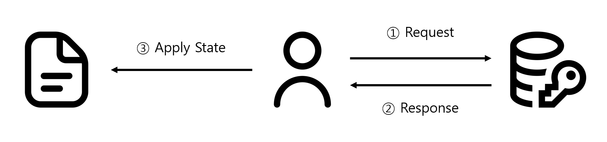
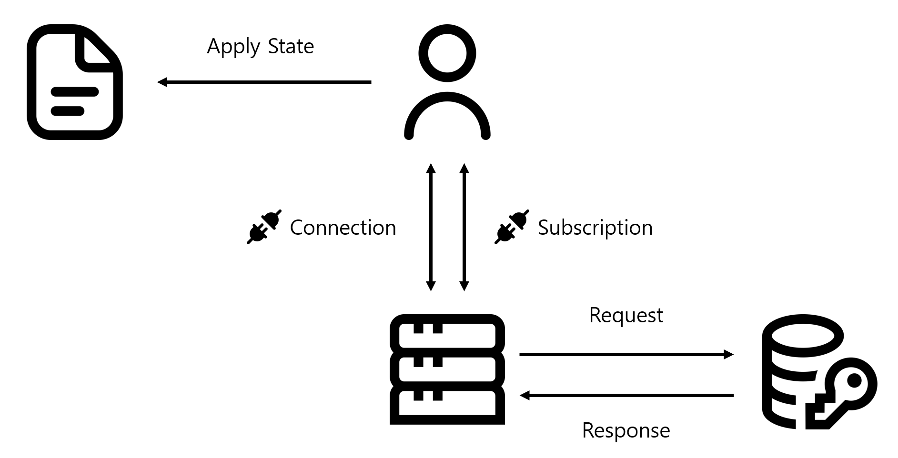
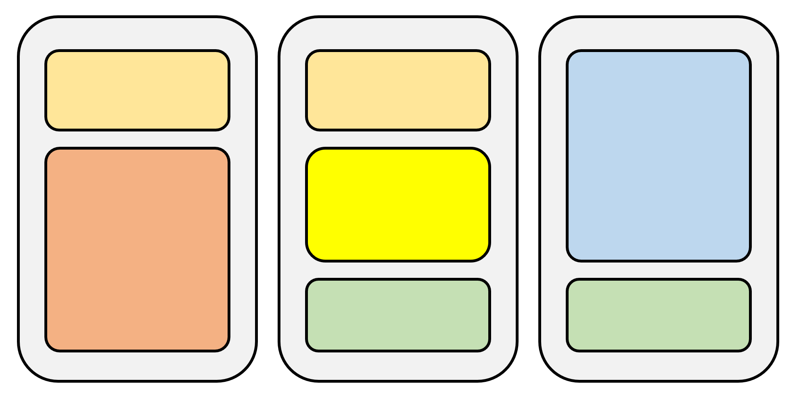
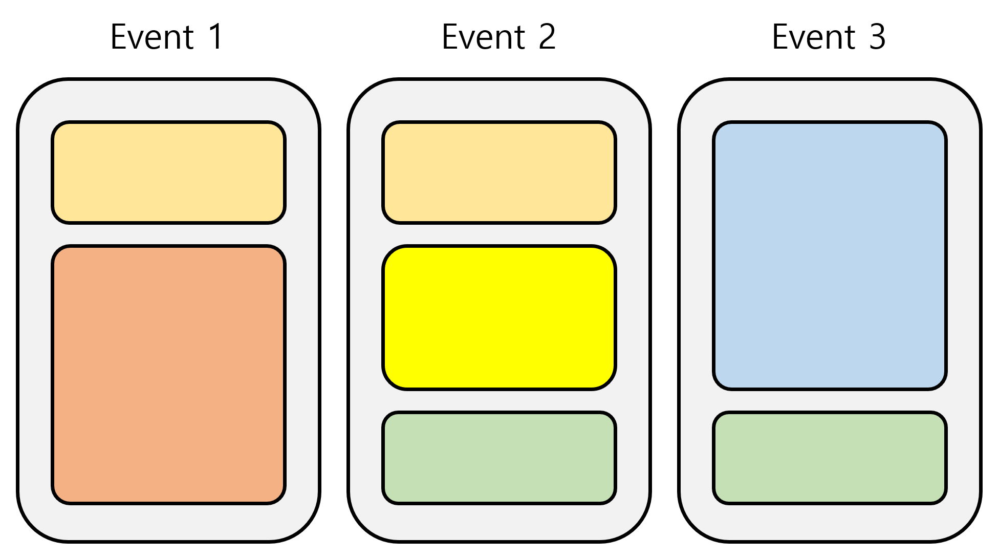

# 2. 코드 관리

채팅을 성공적으로 구현하고 난 뒤, 이제는 다른 정보를 발신, 수신하는 코드를 구현하게 됩니다. 그런데 질의 응답, 히스토리, 게임 상태 변경 등등 적지 않은 부분을 구현해야 하다 보니 처음에는 막막했습니다. 특히 걱정된 것은, 유지 보수가 용이하면서도 정상적으로 상태를 저장하는 코드를 저장하는 것이었습니다.

### State 저장 - HTTP API와 Websocket API

이 질문에 대한 답을 확실하게 얻은 부분은 여기서 출발하였습니다. 웹 개발에서 가장 일반적인 방식이고, Zustand를 배우면서 코드 구조를 어떻게 짜는지도 배우게 되었기 때문입니다.

웹 환경에서 API를 호출할 때는 요청과 응답을 활용합니다. 데이터를 가지고 API로 요청을 보내면, Server에서 API에 대한 응답을 받는 기본적인 구조입니다. 여기에 State를 반영하는 방법은 사람마다 다를 수도 있지만, 안정성 측면에서 보면 응답을 받고 난 뒤에 적용하는 것이 좋다고 생각했습니다. `GET` 등 응답 데이터로 UI를 구성하는 경우 때문이기도 하고, 추후 관리를 위해 일관성 있는 코드가 필요하기도 했습니다. 즉 response 이후 State 전이를 수행한다고 하면, 대략적인 도식화는 다음과 같습니다.



이 그림에서 역할 별로 파일을 분리한다면, 다음과 같이 나눌 수 있습니다. 물론 프로젝트의 크기 또는 코드 길이에 따라서 추가로 코드를 분리하거나, 별도 폴더를 둘 수도 있습니다.

- API 요청 함수
- 응답 처리 함수
- State 상태 값 및 전이 함수

Websocket이 HTTP와 다르지만, **요청 → 응답 → State 적용**이라는 구조와 유사한 면은 존재합니다. 물론 서버가 요청에 의존하지 않기 때문에 **응답 → State 적용**의 순서를 가질 수도 있습니다. 하지만 하위 구조로 포함할 수도 있어 역할 별 파일 구성은 크게 변함이 없을 것입니다.

HTTP 대비 한 가지 주요 차이점은 메시지 송신에 따른 코드 구성입니다. 수신의 경우 받은 데이터를 Mapping하여 State에 반영한다는 점은 HTTP와 동일합니다. 하지만 송신의 경우 아래 그림처럼 Websocket 연결 → Subscription 구독 추가라는 준비 단계가 있어야 메시지 송신을 수행할 수 있습니다. 송신의 경우 HTTP의 API 요청 함수와 동일한 역할을 수행한다고 보면, 단 두 가지만 추가하면 됩니다: Websocket 연결 관리, Subscription 구독 관리.

주의할 점은 Subscription에 사용되는 수신 채널과 송신에 사용되는 송신 채널의 이름은 서로 다르다는 것입니다. 처음에는 송신 채널과 수신 채널을 같은 이름으로 써서 메시지가 섞이는 버그가 발생했습니다. 그제야 송신과 수신 채널을 구분해야 한다는 사실을 깨달았습니다.



기존 HTTP 그림에서 Websocket 요소가 추가된 State 전이 도식을 참고하면 다음과 같이 나뉩니다.

- API 요청 함수
- 응답 처리 함수
- State 상태 값 및 전이 함수
- **Websocket 연결 관리 함수 (추가)**
- **Websocket 구독 관리 함수 (추가)**

지금까지 내용을 요약하면 아래 표와 같습니다. 핵심은 HTTP API는 요청/응답 기반의 정형화된 형식이 존재하기에 개발이 용이합니다. 반면 Websocket API는 이벤트 기반 형식으로 그 형태가 매우 다양하게 변화할 수 있습니다. 

| 구분 | HTTP API | WebSocket API |
| --- | --- | --- |
| 연결 방식 | 요청 시마다 새 연결 생성 | 한 번 연결 후 지속 유지 |
| 요청 구조 | `Request → Response` | `Connect → Subscribe → Send/Receive` |
| 상태 관리 | 응답 데이터 기반 State 반영 | 이벤트 기반 State 반영 |
| 데이터 전송 방향 | 단방향 (Client → Server 요청) | 양방향 (Client ↔ Server) |

### WebSocket API 데이터

Websocket의 API를 수신하는 방법은 수신 채널을 통해서만 이루어집니다. 실제 개발에서는 Websocket을 통해 여러 개의 메시지를 전달하기 때문에 그에 맞는 데이터로 수시로 이루어집니다. 다만, Client 입장에서는 데이터에 대한 정보만 받을 뿐, State에 적용해야 하는 방법은 Client가 알아서 한다는 점입니다. 여기서 파생된 문제는 유사한 데이터 정보를 받는 경우 어떻게 데이터를 처리해야 하는지 고민이 있었습니다.



만약, 위의 그림처럼 유사한 수신 데이터 구조가 서로 다른 State 전이를 수행한다고 가정해봅시다. 같아 보이는 데이터들은 어떻게 구분하는 것이 좋을까요? 메시지 데이터의 속성 존재 여부로 구분하는 것이 좋을까요? 그렇다면 또 다른 비슷한 데이터 구조가 있을 경우 어떻게 구분하나요? 속성 조건을 더 추가해야 할까요? 이렇게 작성하면 수신 유형이 많아질수록 구조도 매우 복잡해지고, 디버깅도 어려워집니다. 그렇다고 채널을 무턱대고 늘리기에는 Client와 Server에 가해지는 부하가 부담스럽습니다.

이를 두고 백엔드 팀원과 같이 논의한 결과, 해답은 아래 코드 및 사진처럼 데이터에 event type을 같이 제공하는 것입니다. 각각 전달하는 데이터에 event type을 지정해, 데이터 처리 방법을 Client에게 알려주는 것입니다. 마치 HTTP의 Method와 비슷한 역할을 하는 것입니다. 이렇게 하여 동일한 채널에 event type이 중복되지 않는다면 이 정보만 가지고 나눠서 개발하기도 쉽고, 확장성도 높아지게 되었습니다. 채널을 더 늘리지 않아도 되었기에 Server 및 Client 부담도 덜어지게 되었습니다.

```json
{
  "eventType": "GAME_STATE_UPDATED",
  "payload": {
    ...
  }
}
```

```tsx
switch (message.eventType) {
  case "GAME_STATE_UPDATED":
    ...
    break;
  case "CHAT_MESSAGE":
    ...
    break;
}
```



### 단일 책임 원칙

단일 책임 원칙은 클래스와 깊은 관계가 있습니다. 하나의 역할만 책임지게 하는 것이 핵심으로, 클래스의 캡슐화, 확장성, 유지 보수 등 여러 방면에서 중요하게 여겨집니다. 이 점은 OOP를 지원하는 프로그래밍 언어에서 중요하게 여겨지는 부분입니다.

Front-end 개발의 경우에는 상대적으로 덜 여겨지는 부분입니다. 재사용성을 중시하는 class의 경우 복잡도가 늘어나기에, 중요하게 여기는 코드 생산성은 상대적으로 떨어지게 됩니다. (물론 `.js` 나 `.ts` 파일 등을 사용해 기능을 class화하여 만드는 경우도 있습니다.) 대표적으로 사용하는 React만 하더라도, Component를 작성할 때 Class로 작성하지 않고 Function으로 작성하는 것이 대표적인 예입니다.

다만 단일 책임 원칙에 대한 핵심을 완전히 배제하기는 어렵습니다. Component와 State 설계를 아무렇게 하면 확장성과 관리에 큰 어려움이 있기 때문입니다. 나중에 코드를 수정해야 할 수도 있고, 추후 다른 곳에서 Component를 재활용하거나, State를 여러 번 가져오는 경우도 존재하기 때문입니다.

```
src/
├── api/
│    └── gameAPI.ts      # API 요청/응답 관리
├── stores/
│    └── gameStore.ts    # Zustand 상태 관리
├── sockets/
│    └── gameSocket.ts   # WebSocket 연결 & 구독 관리
├── components/
│    ├── GameBoard.tsx   # UI 레이어
│    └── ChatPanel.tsx
```

이에 대해 Front-end에서는 파일 하나하나가 각각에 대한 class를 정의한다고 생각하게 되었습니다. Component 입장에서는 다른 파일에서 불러와 조합하여 사용하는 경우가 있고, State는 여러 곳에서 불러와 정보를 UI에 반영하거나 업데이트하게 됩니다. Websocket을 다루는 Utility 함수에도 동일하게 작용합니다. 생산성을 고려해 class로 작성했던 것을 파일에서 import하여 함수처럼 사용하는 차이만 있을 뿐입니다. 그렇기에 Front-end는 무엇보다 파일 구조를 잘 나누는 것이 단일 책임 원칙을 지킨다고 볼 수 있었습니다.
